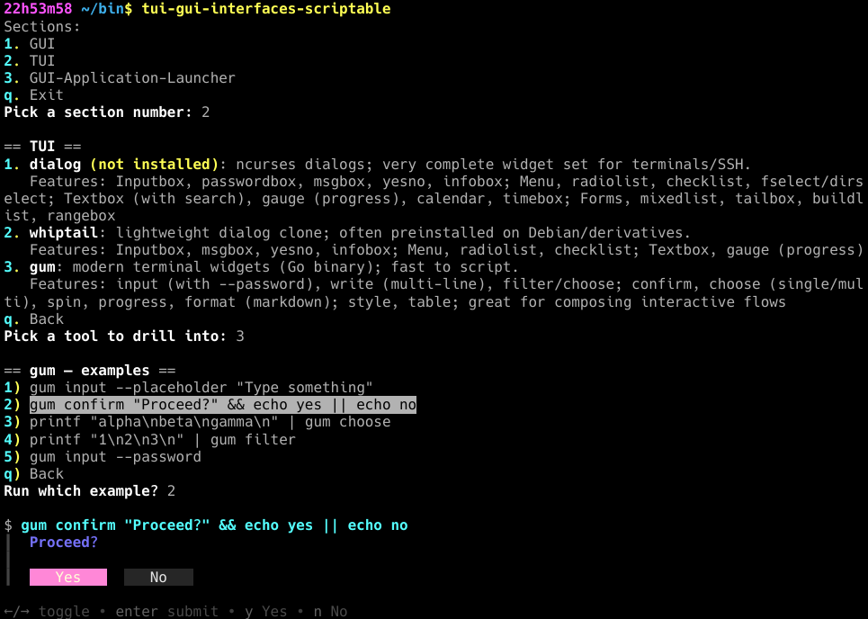

## TUI-GUI Interfaces-Scriptable)

**Project repo**: [https://github.com/jaggzh/tui-gui-interfaces-scriptable](https://github.com/jaggzh/tui-gui-interfaces-scriptable)

A convenient shell (TUI) to examine and evaluate some options for scriptable TUIs / GUIs.

Allows you to pick and see some example outputs of different TUIs.

This is a first version -- we definitely need more examples added to this thing.

  <em>Example run...</em> 
   

## Credits

*jaggz.h {who is at} gmail.com*
